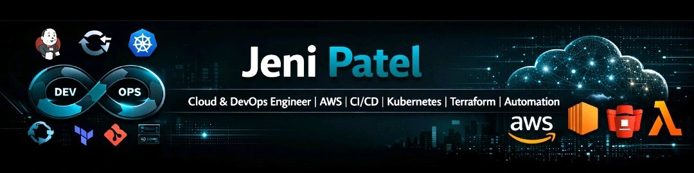

  

  

  
  
  
  

<!-- 

  

 -->

## About Me
I’m Jeni Patel, a Cloud & DevOps engineer with 5+ years of experience building resilient infrastructure and reliable CI/CD practices. I specialize in designing and automating infrastructure on AWS (and multi-cloud), container orchestration with Kubernetes, and end-to-end pipeline delivery with Jenkins/GitHub Actions.

I enjoy solving delivery bottlenecks with infrastructure-as-code, implementing observability with Prometheus/Grafana, and contributing to open-source automation projects. My focus is on scalable, secure systems that empower teams to deploy faster with lower risk.

- **👀 Interests:** Cloud native operations, automation, observability, platform engineering
- **🌱 Currently Learning:** GitOps, Kubernetes operator development, serverless architecture patterns
- **💞️ Looking to Collaborate On:** DevOps projects, open-source contributions, infrastructure automation
- **📫 How to Reach Me:** pateljeni007.jp@gmail.com
- **😄 Pronouns:** He/His
- **⚡ Fun Fact:** I enjoy optimizing complex workflows and solving challenging infrastructure problems.

## 🛠️ Technologies & Tools
- **DevOps Tools:** Jenkins, Docker, Kubernetes, Terraform, Ansible, Prometheus, Grafana
- **Programming Languages:** Bash
- **Cloud Providers:** AWS, Azure, Google Cloud
- **Others:** Git, GitHub Actions, Helm, VS Code

## Projects
Here are some of the projects I'm working on to further enhance my DevOps skills:

### 1. Kubernetes Cluster Deployment
- **Objective:** Create a Kubernetes cluster from scratch and deploy a sample application.
- **Technologies:** Kubernetes, Docker, Helm, Terraform.
- **Description:** 
  - Set up a Kubernetes cluster using tools like Minikube, kops, or managed services like EKS, GKE, or AKS.
  - Use Terraform for infrastructure provisioning.
  - Deploy a sample application, such as a simple web app, using Helm charts.
  - Implement monitoring and logging with Prometheus and Grafana.
- **Repository:** [Kubernetes Cluster Deployment](#)

### 2. CI/CD Pipeline with Jenkins
- **Objective:** Set up a continuous integration and continuous deployment (CI/CD) pipeline.
- **Technologies:** Jenkins, GitHub Actions, Docker, Kubernetes.
- **Description:** 
  - Create a Jenkins pipeline to automate the build, test, and deployment of a sample application.
  - Integrate Jenkins with GitHub for automatic triggers on commits and pull requests.
  - Use Docker for containerizing the application and Kubernetes for deployment.
  - Implement automated testing and deployment to a staging environment.
- **Repository:** [CI/CD Pipeline with Jenkins](#)

### 3. Infrastructure as Code with Terraform
- **Objective:** Manage infrastructure using Terraform.
- **Technologies:** Terraform, AWS or Azure.
- **Description:** 
  - Write Terraform scripts to provision infrastructure on AWS or Azure.
  - Automate the deployment of resources such as VPCs, EC2 instances, S3 buckets, and RDS instances.
  - Implement remote state management and version control for Terraform scripts.
  - Create modules for reusable infrastructure components.
- **Repository:** [Infrastructure as Code with Terraform](#)

### 4. Dockerized Application Deployment
- **Objective:** Containerize and deploy a sample application using Docker.
- **Technologies:** Docker, Docker Compose.
- **Description:** 
  - Write a Dockerfile to containerize a sample application.
  - Use Docker Compose to manage multi-container applications.
  - Deploy the containerized application on a local machine or cloud environment.
- **Repository:** [Dockerized Application Deployment](#)

## Get in Touch
Feel free to reach out to me if you have any questions or if you’re interested in collaborating on a project!

- **Email:** pateljeni007.jp@gmail.com
- **LinkedIn:** [Jeni Patel on LinkedIn](https://www.linkedin.com/in/jeni-patel-devops-engg)

## Contributions
I welcome contributions and feedback! Please feel free to submit issues and pull requests.

## License
This repository is licensed under the MIT License.